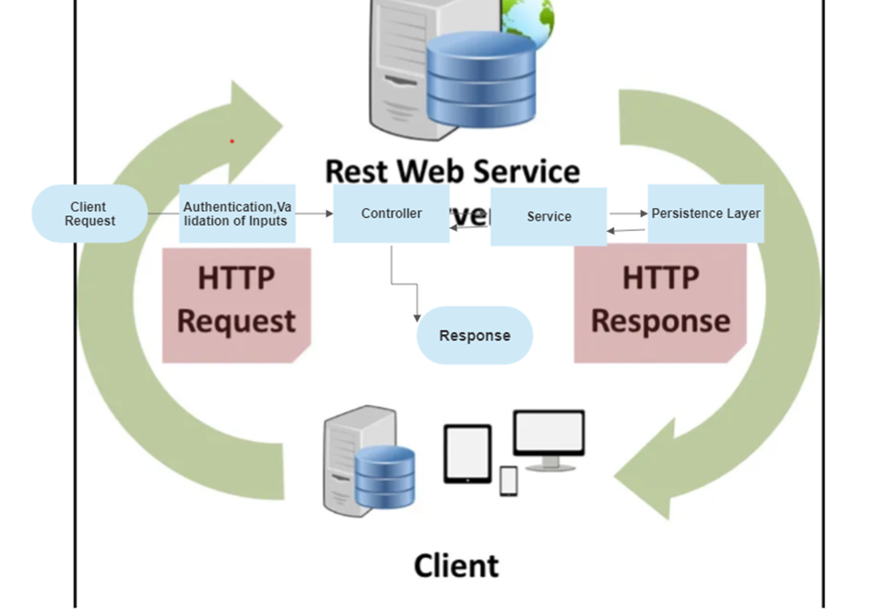
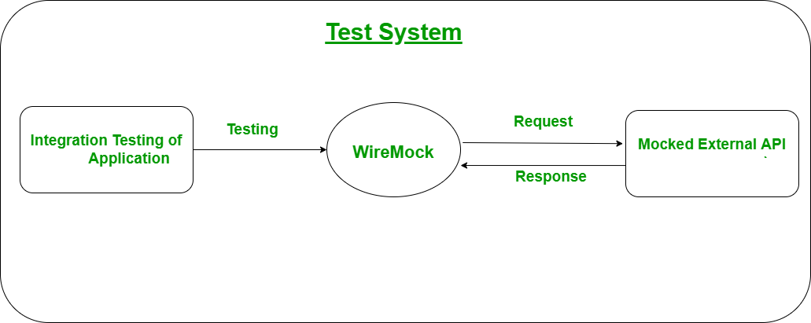
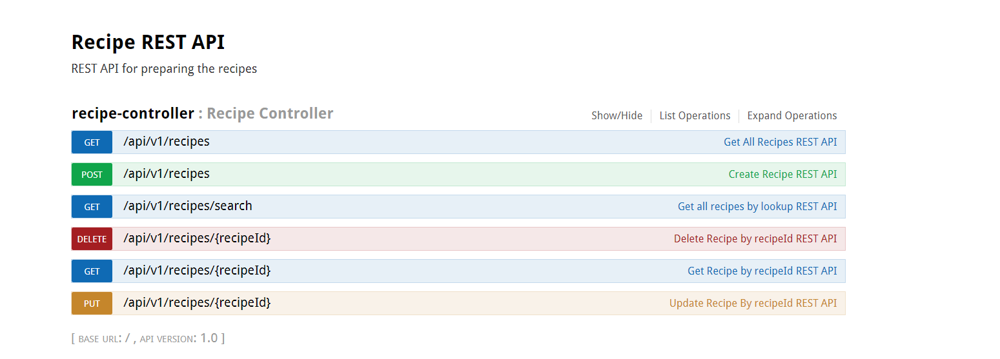

# Recipe REST API

## Technical Design:

* Note: Detail design please refer Technical document attached in the Path

### Below key principles I have followed my Rest full API

1. Followed Layered ,Loose coupled design approach – Clear Separation for responsibility.
2. Designing meaningful end points with usage of proper HTTP methods .
3. Considered Idempotency in Resource create/modification in API’s
4. Data base modelling– followed normalisation principle – Used in memory db (h2)
   for time being can be replaced with any SQL database. Ideal solution would be NoSql for
   better performance
5. Keeping in mind Security – Implemented input validation and proposing authentication and authorization with JW.
6. Centralizing the cross cutting concerns - Logging , Performance metrics
7. Performance Optimisation - Index
8. Request processing– Proper error handling ,quick filtering – Pagination ,Sorting and Addition information about
   resource.
9. Performance ,Reusability, Scalable ,Readability
10. Improve the application performance with cache layer - Proposed
11. API Documentation with Swagger
12. Unit test cases with Junit & Mockito
13. Integration test cases with Wiremock.

## Technolgies Used

* Java 11
* Spring boot - 2.7.9
    * web, aop, jpa, test, embedde tomcat, logging,log4j2
* H2 Database - 2.1.214
* Swagger2 - 2.4.0
* Wiremock - 2.35.0 (Integration Test)
* Mockito

## How to Run Application

This application is packaged as a jar which has Tomcat 9 embedded. No Tomcat or JBoss installation is necessary. You run
it using the java -jar command.

* Clone this repository
* Make sure you are using JDK 11 and Maven 3.x
* You can build the project and run the tests by running mvn clean package
* Once successfully built, you can run the service by one of these two methods:

      java -jar target\recipe-1.0.jar
                or
      mvn spring-boot:run
* Check the stdout or recipe.log file to make sure no exceptions are thrown

      2023-03-08T11:03:00,489 INFO  [main] o.a.j.l.DirectJDKLog: Starting ProtocolHandler ["http-nio-8080"]
      2023-03-08T11:03:00,508 INFO  [main] o.s.b.w.e.t.TomcatWebServer: Tomcat started on port(s): 8080 (http) with context path ''

## Integration Testing 
   For the integration testing , provided a simulator to environment to consumers with the help of WireMock -Standalone.
   End points exposed as part of Integration Testing .
   1.Getting all reciepies 
   2.Creating a reciepe
   3.An fault response Use case
   

## Steps to Run Integration tests

* We used Wire mock in standalone mode
* 1.Start the Wire mock server by navigating this path
* {working directory}\recipe\src\test\WiremockIntegrationTest Run the below command -

      java -jar wiremock-jre8-standalone-2.35.0.jar --port {port number}

* It will start the server on default port number 8080 (skipped port i command) ,if fails specify port number
* Once the Server is up.You can hit endpoint API's on registered port number .
* 

## Swagger Documentation:

* Below are the endpoints implemented

